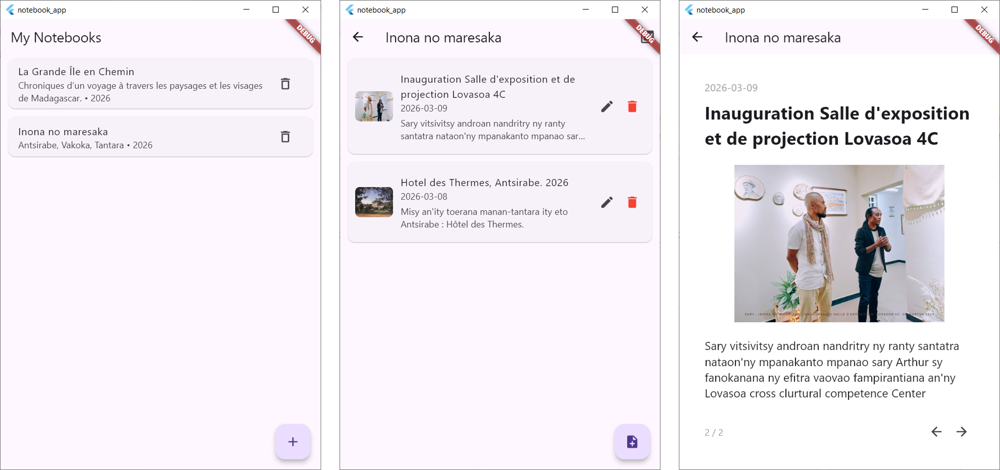

# Printable Photobook/Notebook App

A simple **desktop Photobook/Notebook application** built with **Flutter** that allows users to create notebooks, add notes with images, and export them as a **printable PDF book**.

This project was built as a lightweight **local-first note taking tool** focused on **structured notebooks and printable exports**.

---

# Features

## Photobook/Notebook Management

* Create notebooks
* Each notebook contains:

  * Title
  * Subtitle
  * Year

## Notes

Inside each notebook you can create notes containing:

* Date
* Title
* Caption
* One image

Notes can also be:

* edited
* deleted

## Image Support

Each note can include **one image stored locally**.

Images are displayed in the notebook view and included in the PDF export.

## PDF Export

Notebooks can be exported as a **printable PDF book**.

The generated PDF includes:

* Cover page
* One page per note
* Image display
* Caption section
* Page numbers
* Print-friendly margins

---

# Screenshots

Screenshots of the app screens :

# Screenshots


[Notebooks list](screenshots/notebooks_list_screen.png)
[Notebook detail](screenshots/notebook_detail_screen.png)
[Create note](screenshots/create_note_screen.png)
[Note reader](screenshots/note_reader_screen.png)

## Example PDF export

📄 Download a sample exported notebook:

[Sample Notebook PDF](examples/sample_notebook_export.pdf)

---

# Tech Stack

* **Flutter**
* **SQLite** (local database)
* **sqflite_common_ffi** (desktop database support)
* **pdf** (PDF generation)
* **printing** (PDF preview and export)

---

# Project Structure

```
lib/
 ├── models/
 │    ├── notebook.dart
 │    └── note.dart
 │
 ├── database/
 │    └── database_helper.dart
 │
 ├── services/
 │    ├── image_service.dart
 │    └── pdf_service.dart
 │
 ├── screens/
 │    ├── notebooks_list_screen.dart
 │    ├── notebook_detail_screen.dart
 │    ├── create_notebook_screen.dart
 │    └── create_note_screen.dart
 │
 └── main.dart
```

---

# Installation

### 1 Install Flutter

[https://flutter.dev/docs/get-started/install](https://flutter.dev/docs/get-started/install)

Check installation:

```
flutter doctor
```

---

### 2 Clone the repository

```
git clone https://github.com/your-username/notebook-app.git
```

```
cd notebook-app
```

---

### 3 Install dependencies

```
flutter pub get
```

---

### 4 Run the application

For desktop (Windows):

```
flutter run -d windows
```

---

# Database

The application uses **SQLite stored locally on the user's machine**.

The database contains two tables:

### notebooks

```
id
title
subtitle
year
```

### notes

```
id
notebookId
date
title
caption
imagePath
```

---

# Current Status

This project currently implements a **functional MVP**.

Implemented features:

* notebook creation
* note creation
* note editing
* note deletion
* image attachment
* PDF export

---

# Future Improvements

Possible improvements include:

* drag & drop note ordering
* multi-image notes
* notebook cover image
* better PDF book layout
* automatic page breaks for long captions
* Android support
* PDF sharing
* dark mode

---

# Target Platforms

Currently tested on:

* Windows (desktop)

Possible future targets:

* Android
* Linux
* macOS

---

# License

MIT License

---

# Author

Created by **Rantsa**